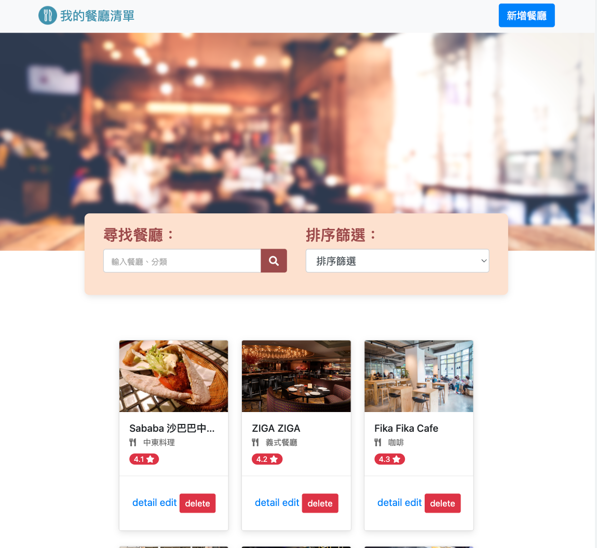
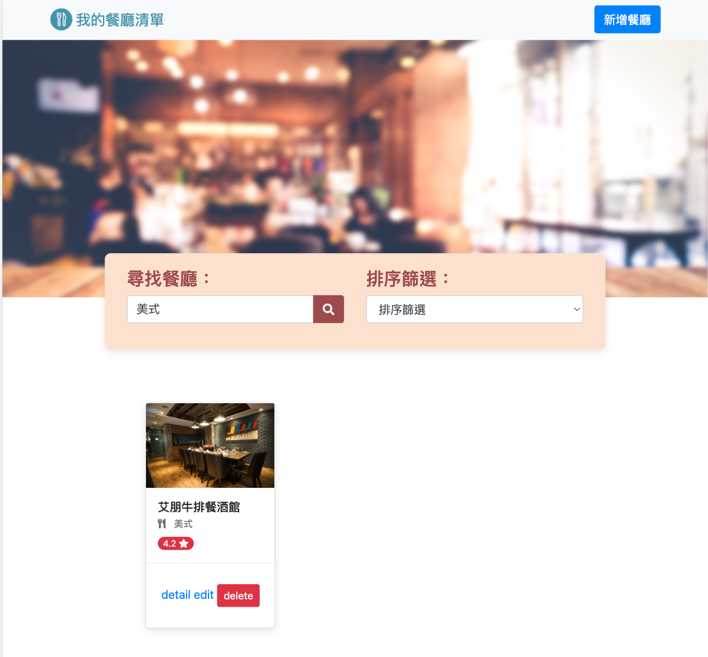

## Ｍy Restaurant 我的餐廳清單

### 功能介紹

- 查看目前已有的收藏餐廳清單
- 點擊瀏覽餐廳的詳細資訊
- 連結餐廳的地址到 Google 地圖
- 搜尋清單中的特定餐廳

### 專案畫面

- 首頁


- 餐廳資訊


- 搜尋頁面


### 安裝

1. 透過終端機(Terminal)，先將此專案存放至本地位置

2. 在本地開啟之後，透過終端機進入資料夾，輸入：

   ```bash
   npm install
   ```

3. 安裝完畢後，繼續輸入：

   ```bash
   npm run dev
   ```

4. 若看見此行訊息則代表順利運行，打開瀏覽器進入到以下網址

   ```bash
   Listening on http://localhost:3000
   ```

5. 若欲暫停使用

   ```bash
   ctrl + c
   ```

## 開發工具

- Node.js 10.15.0
- Express 4.18.1
- Express-Handlebars 3.0.0
- Bootstrap 4.3.1